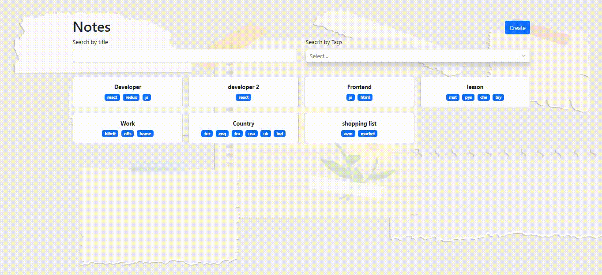

# React + TypeScript + Vite

# Notes Application

This project is a note-taking application developed using React and Vite. The application is written in TypeScript and includes features such as adding, editing, and deleting notes. Additionally, it provides the ability to filter notes based on title and tags.

## Features

- **Add Note:** You can add new notes.
- **Edit Note:** You can edit existing notes.
- **Delete Note:** Remove notes that are no longer needed.
- **Filter by Title and Tags:** Filter notes based on title or tags.

## Getting Started

To run the project locally, follow these steps:

1. Download the project files to your computer.
2. Open a terminal or command prompt and navigate to the project directory.
3. Use the `npm install` command to install dependencies.
4. Start the project with the `npm run dev` command.
5. Open your browser and go to [http://localhost:3000](http://localhost:3000) to view the application.

## Usage

The application runs at [http://localhost:3000](http://localhost:3000).

1. On the homepage, use the "Add New Note" button to add new notes.
2. Click on an existing note to edit or delete it.
3. Use title and tag filtering options to organize your notes.

## Contributing

If you would like to contribute to the project, please create a pull request. We welcome any contributions and suggestions!
